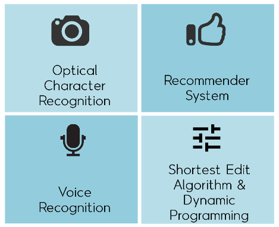
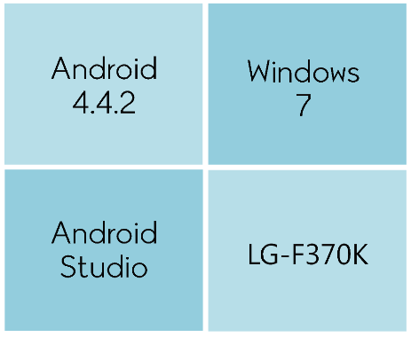

## Beer4You

#### Description
Implemented an Android app which presents information on beers to users when they capture beers' logo using the image recognition. The app further recommends beers to users based on their previous search histories.

#### Beer4You

#### Beer4You Applied Technology

#### Beer4You Development Environment

#### Beer4You Slides

